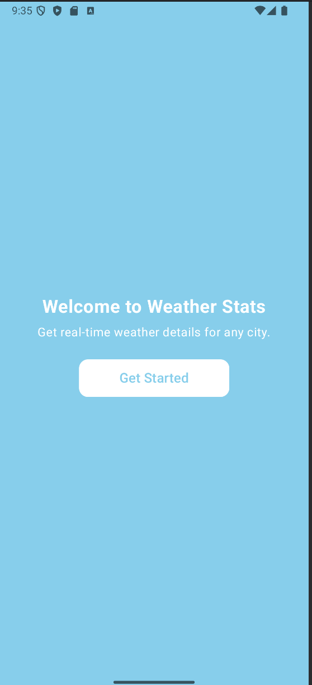
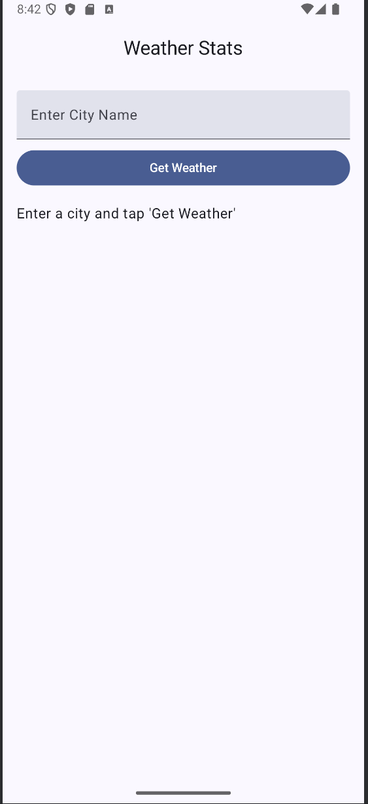
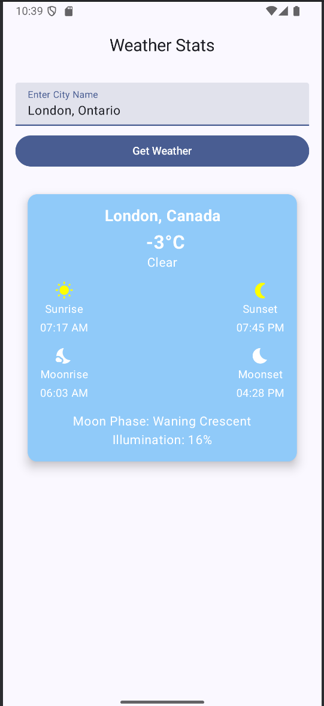

<h1>What does it do?</h1>
An Android app that displays weather statistics for a user-defined location (that exists in the real world), built using Android Studio. The app makes use of the Weatherstack API to fetch the required information. For more information on Weatherstack, check <a href="https://weatherstack.com/" target="_blank">their website</a>.

The app currently displays:

<ol>
    <li>Location: "city, country"</li>
    <li>Temperature: "celsius"</li>
    <li>Condition: "clear/cloudy/..."</li>
    <li>Sunrise, Sunset, Moonrise, Moonset</li>
    <li>Moon phase and illumination</li>
</ol>

<h1>Why?</h1>
Just a personal project to test out Android app development, and to experiment with Kotlin and Android Studio. Also to experiment with designing UIs and making use of APIs.

<h1>What it looks like right now:</h1>

    
    
    

