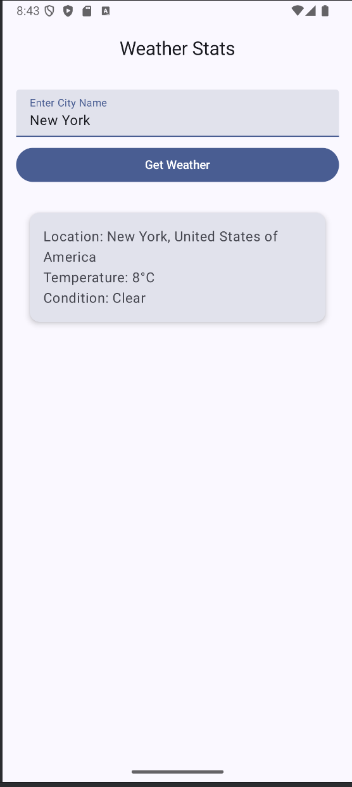

<h1>What?</h1>
An Android app that displays weather statistics for a user-defined location (that exists in the real world), built using Android Studio. Currently a work in progress, weather data currently works for most test cases (eg: New York, USA). Working on the UI now.

<h1>Why?</h1>
Just a personal project to test out Android app development, and to experiment with Kotlin and Android Studio.

<h1>What it looks like right now:</h1>

